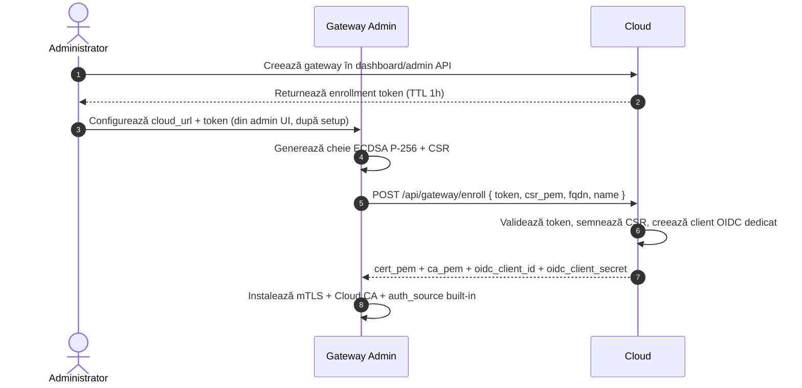
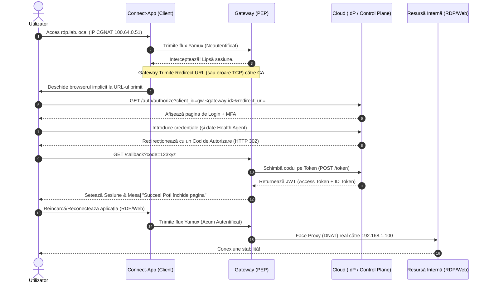
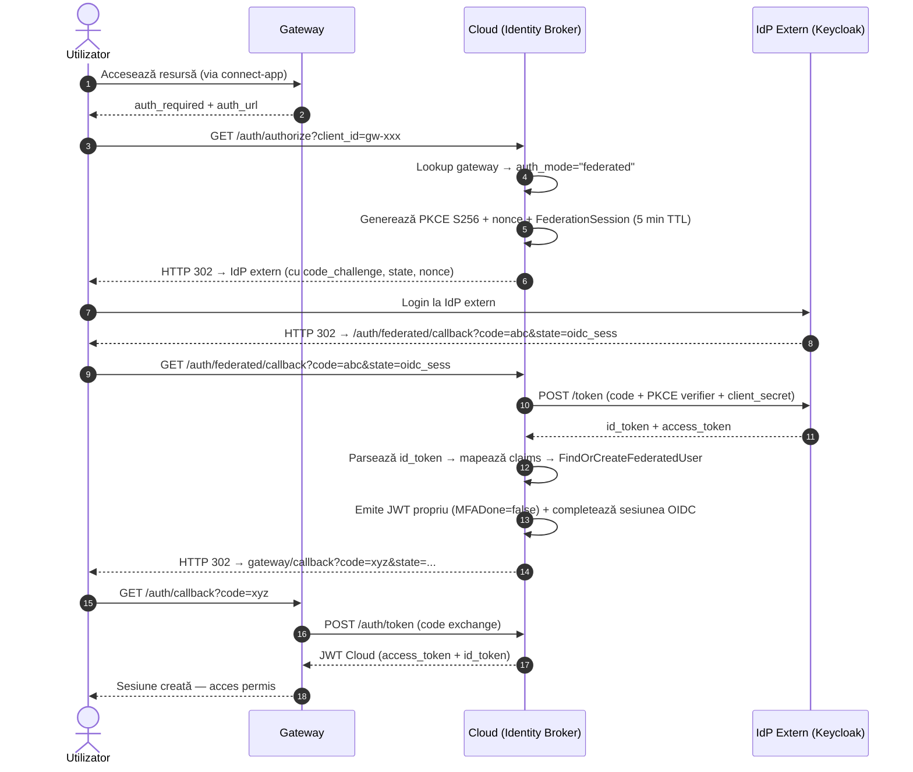

# Integrarea Fluxului OIDC / OAuth2 în Arhitectura ZTNA

Implementarea interceptării la nivel de Gateway folosind standarde precum OAuth 2.0 sau OpenID Connect (OIDC) transformă sistemul într-unul Enterprise, standardizat. 

În acest model:
* **Cloud-ul (Port 8443)** acționează ca un **Identity Provider (IdP)**.
* **Gateway-ul (Port 9443)** acționează ca un **Service Provider (SP)** sau **Relying Party (RP)**.

Iată cum se desfășoară tehnic acest flux, pas cu pas, tratând ambele cazuri (aplicații Web și aplicații TCP native precum RDP).

## Actualizare Arhitecturală: Enrollment și Bootstrap Dinamic

Implementarea curentă extinde fluxul OIDC cu un mecanism de enrollment pentru gateway-uri:

* Gateway-ul nu mai depinde de un `client_id` OIDC hardcodat.
* Cloud-ul generează un **one-time enrollment token** pentru fiecare gateway nou.
* Gateway-ul trimite un **CSR PEM** la enrollment și primește înapoi:
   * certificatul mTLS semnat de cloud,
   * certificatul CA al cloud-ului,
   * `client_id` și `client_secret` OIDC dedicate gateway-ului.
* Cloud-ul expune și endpoint-uri de lifecycle pentru gateway:
   * `POST /api/gateway/enroll`
   * `POST /api/gateway/renew-cert`
   * `GET /api/gateway/resources`
   * `GET/POST /api/admin/gateways`

### Fluxul de Enrollment al Gateway-ului



## Diagrama Fluxului de Autentificare (Authorization Code Flow)



---

## Detalierea Tehnica a Pașilor

### Pasul 1: Încercarea de Acces
Când `connect-app` deschide un `stream` nou prin Yamux pentru a trimite pachetele TCP capturate, Gateway-ul verifică starea sesiunii acelui flux.
Dacă conexiunea este nouă și neautorizată, conexiunea către aplicația finală este pusă *on hold* (pe pauză).

### Pasul 2: Interceptarea și Inițierea OIDC
Gateway-ul generează un URL de tip OAuth2 Authorization, trimițând utilizatorul la Cloud pentru a se autentifica.

* **Pentru Web (HTTP 80/443):** Gateway-ul răspunde direct cu un header `HTTP 302 Found`.
* **Pentru TCP (RDP/SSH):** Gateway-ul răspunde în interiorul stream-ului Yamux cu un metadata personalizat:
   `{"status": "auth_required", "auth_url": "https://cloud.companie.com/auth/authorize?client_id=gw_dedicat&response_type=code&redirect_uri=https://gateway.companie.com/callback&state=xyz..."}`

`connect-app` citește acest răspuns și deschide imediat browserul sistemului pe acel `auth_url`.

### Pasul 3: Autentificarea la Cloud (IdP)
Acesta este mediul 100% controlat de tine prin interfețele web.
URL-ul primit la Pasul 2 a dus browserul utilizatorului pe platforma ta de cloud.
* Utilizatorul vede interfața frumoasă de login React/Vue.
* Introduce Username/Parolă.
* Confirmă MFA (Duo Push, TOTP).
* Cloud-ul primește, în fundal, scorul de sănătate de la `device-health-app` direct.

### Pasul 4: Întoarcerea (The Callback)
Dacă totul este valid, Cloud-ul (IdP) nu îi dă token-urile direct browserului. Îi dă un **Authorization Code** temporar și sigilat.
Browserul este redirecționat automat (via `HTTP 302`) înapoi la Gateway:
`https://gateway.companie.com/callback?code=abc123def456&state=xyz...`

**Protecții suplimentare pe callback:**
- **Rate limiting per IP**: Maxim 10 cereri pe minut per adresă IP. Depășirea → 429 Too Many Requests.
- **State hash cu server nonce**: State-ul este verificat suplimentar cu un hash SHA-256 generat din state + nonce secret intern al serverului, prevenind forjarea state tokens.
- **Error sanitization**: Erorile returnate de IdP sunt logate server-side dar **nu sunt expuse** utilizatorului în browser (se afișează un mesaj generic).

### Pasul 5: Schimbul Sigur de Token-uri (Token Exchange)
**(Aceasta este inima securității OIDC!)**
Când browserul ajunge la URL-ul Gateway-ului cu acel `code`, Gateway-ul oprește cererea. Fără știrea browserului, **Gateway-ul vorbește direct (Backend-to-Backend)** cu Cloud-ul:
```http
POST https://cloud.companie.com/auth/token
Content-Type: application/x-www-form-urlencoded

client_id=gateway_1
&client_secret=secret_cunoscut_doar_de_gateway
&grant_type=authorization_code
&code=abc123def456
```
Cloud-ul verifică dacă Gateway-ul este legitim și dacă a dat acel `code`. Dacă da, Cloud-ul răspunde cu `access_token` (JWT).

### Pasul 6: Autorizarea Tunelului Yamux
* Gateway-ul parsează JWT-ul primit. 

---

## Observații de Design

* Certificatul mTLS al gateway-ului este short-lived și trebuie reînnoit prin CSR nou.
* `client_id` și `client_secret` OIDC sunt per-gateway, nu globale.
* Credențialele OIDC ale gateway-ului sunt distincte de credențialele per-aplicație folosite pentru autorizarea resurselor în cloud.
* Gateway-ul poate folosi fie **Cloud IdP built-in** (login form propriu), fie un **IdP extern** (Keycloak, Okta, etc.) configurat per-gateway prin `auth_mode` („builtin” sau „federated”). Cloud-ul acționează ca **Identity Broker**: primește cererea de autorizare din partea gateway-ului, rutează utilizatorul către IdP-ul corect, apoi emite propriul JWT indiferent de sursa autentificării. Gateway-ul nu cunoaște dacă utilizatorul s-a autenticat local sau extern.
* Acum știe **exact** cine este utilizatorul (ex: `admin@ztna.local`) și ce rol are.
* Gateway-ul marchează conexiunea de bază Yamux (venită de la acel IP de unde a picat testul inițial) ca fiind **Autorizată și Activă**.
* Browserului îi afișează o pagină simplă de tip HTML la Gateway: *"Autentificare Reușită! Poți închide această fereastră și te poți reconecta la aplicație."*

### Pasul 7: Accesul Liber
Utilizatorul închide browserul. Re-apasă butonul "Connect" în clientul RDP.
Pachetele ajung prin `connect-app` și Yamux la Gateway.
Acum, Gateway-ul evaluează regulile (ex: *Utilizatorul e Admin, Scor=100, are voie RDP? DA*).
Traficul se scurge fluent și invizibil spre serverul intern, executând DNAT-ul descris anterior.

---

## Identity Broker — Federația Identității (Faza 4)

Cloud-ul funcționează ca un **Identity Broker**: fiecare gateway are configurat un mod de autentificare (`auth_mode`). Când modul este `"federated"`, Cloud-ul redirectează browser-ul utilizatorului către IdP-ul extern (ex: Keycloak) în loc să afișeze formularul de login propriu. După autentificarea externă, Cloud-ul mapează claim-urile, provizionează automat utilizatorul și emite propriul JWT.

**Avantaj principal**: Gateway-ul nu se modifică deloc — comunică mereu cu endpoint-urile OIDC ale Cloud-ului. Policy engine-ul și MFA step-up funcționează uniform indiferent de sursa identității.

### Configurare Per-Gateway

Fiecare gateway stochează:
- `auth_mode`: `"builtin"` (implicit) sau `"federated"`
- `federation_config` (doar când federated):
  - `issuer` — URL-ul emitentului extern (ex: `https://keycloak.company.com/realms/master`)
  - `client_id` — clientul OIDC înregistrat la IdP-ul extern
  - `client_secret` — secret opțional (pentru clienți confidențiali)
  - `scopes` — implicit `"openid profile email"`
  - `claim_mapping` — mapare configurabilă (ex: `{"username": "preferred_username", "email": "email"}`)
  - `auto_discovery` — folosește `.well-known/openid-configuration` (cache 6h)

### Diagrama Fluxului Federat



### Provizionare Automată Utilizatori Federați

- La primul login extern, Cloud-ul creează automat un cont cu:
  - `external_subject` = claim-ul `sub` din id_token-ul extern
  - `auth_source` = URL-ul issuer-ului extern
  - `password_hash` = gol (utilizatorul nu are parolă locală)
  - `role` = `"user"` (implicit)
- La login-uri ulterioare, contul existent este găsit via `external_subject` + `auth_source` și actualizat (username, email, last_login)
- Conflicte username: dacă un user builtin are același username, login-ul federat este refuzat

### MFA Step-Up pentru Utilizatori Federați

Utilizatorii federați pot avea metode MFA înregistrate în Cloud (TOTP, WebAuthn, Push). Când policy engine-ul cere MFA la access time, fluxul de step-up funcționează identic cu cel builtin — identitatea vine din JWT-ul deja emis.

### Dashboard Admin: Configurare IdP per Gateway

Pagina **Gateways** din dashboard-ul admin include:
- Coloana **Identity Source** cu badge Built-in / Federated
- Buton **Settings** (⚙) per gateway → modal cu:
  - Radio: Built-in (Cloud IdP) / Federated (External OIDC)
  - Câmpuri condiționale: Issuer URL, Client ID, Client Secret, Scopes, Username Claim, Email Claim
  - Salvare via `PUT /api/admin/gateways/{id}` cu `auth_mode` + `federation_config`
- Secret-ul client_secret nu este expus în GET (securitate)

---

## Status Implementare (Aprilie 2026)

Secțiunile principale din fluxul descris mai sus sunt deja implementate în cod:

1. **Cloud (IdP + Identity Broker + control plane):**
   * Endpoint-uri OIDC active pe `/auth/authorize`, `/auth/token` și `/auth/userinfo`.
   * **Identity Broker** (Faza 4): endpoint `/auth/federated/callback` pentru callback de la IdP extern. Per-gateway `auth_mode` ("builtin" / "federated") cu `FederationConfig` (issuer, client_id, client_secret, scopes, claim_mapping). OIDC discovery cache (6h). PKCE S256 obligatoriu. Provizionare automată utilizatori federați (`FindOrCreateFederatedUser`).
   * **Conditional Access MFA** (Faza 1): MFA nu se cere la login (JWT mereu cu MFADone=false). MFA cerut doar la access time de policy engine. Endpoint `/api/auth/mfa-step-up` pentru inițierea step-up-ului.
   * **MFA multi-metodă** (Faza 1–3): TOTP (HMAC-SHA256, 6 cifre, 30s), WebAuthn/Passkeys (go-webauthn v0.16.4), Push Approval (provocare 2 min, polling 3s, toast Windows). Selecție dinamică bazată pe metodele utilizatorului.
   * **Geo-velocity** (Faza 1b): Geolocalizare IP via MaxMind GeoLite2-City. Detecție impossible travel (Haversine, praguri 500/900 km/h). Ultimele 50 locații per user.
   * **Risk scoring**: 6 factori contextuali (failed attempts, device health, time of day, new device/location, protocol risk, geo-velocity). Scor 0–100.
   * Endpoint-uri de lifecycle gateway active:
     * `POST /api/gateway/enroll`
     * `POST /api/gateway/renew-cert`
     * `GET /api/gateway/resources`
     * `GET/POST /api/admin/gateways` și `GET/PUT/DELETE/POST /api/admin/gateways/{id}`
   * `client_id` OIDC per-gateway (`gw-<gateway-id>`) este generat la enrollment și înregistrat dinamic.

2. **Gateway (PEP/RP):**
   * Setup wizard simplificat în 2 pași: (1) validare setup token, (2) configurare hostname + certificat SSL. Nu creează cont admin — sesiunea se obține direct la finalizare.
   * Cloud enrollment și configurare IdP se fac din admin UI după setup, sau la pornire via variabile de mediu.
   * Pagina de enrollment din admin UI folosește fluxul token-based (fără payload legacy cu `gateway_id/api_key`).
   * Configurarea IdP suportă două moduri: `cloud` (auto-derive endpoint-uri) și `custom` (manual).
   * Callback OIDC + PKCE este activ pe `/auth/callback`.
   * Policy decision `"mfa_required"` → trimite `"auth_required"` + OIDC URL cu `mfa_step=true`.

3. **Dashboard Cloud:**
   * Există pagină dedicată `Gateways` cu listare, creare, regenerare token, revoke, delete.
   * **Per-gateway Identity Source** (Faza 4): coloană "Identity Source" (Built-in / Federated), buton Settings cu modal pentru configurare IdP extern (issuer, client_id, client_secret, scopes, claim mapping).
   * Endpoint-urile `/api/admin/gateways*` sunt expuse în clientul SPA.

4. **Device Health App (Faza 3):**
   * Push Approval: `PushPoller` (polling 3s), evenimente Wails `push:challenge`, toast Windows.
   * Componenta React `PushApproval.jsx` cu overlay modal (approve/deny).
   * Endpoint-uri cloud: `POST /api/auth/push/begin`, `GET /api/auth/push/status`, `GET /api/device/push-challenges`, `POST /api/device/push-challenges/respond`.

5. **Element rămas de completat end-to-end:**
   * Clientul de sincronizare periodică a resurselor din cloud (`GET /api/gateway/resources`) nu este încă implementat pe gateway.
   * Endpoint-ul există în cloud; partea de consum periodic în gateway rămâne un pas separat.

---

## Hardening Securitate Gateway (Implementat)

Pe lângă fluxul OIDC+PKCE descris mai sus, gateway-ul implementează următoarele măsuri de securitate enterprise:

### Autentificare Admin
* Token-ul admin este stocat într-un **HttpOnly cookie** (`Secure`, `SameSiteStrict`) — inaccesibil din JavaScript (protecție XSS).
* Token-ul CSRF folosește pattern-ul **double-submit** (cookie HttpOnly + header `X-CSRF-Token`).
* Endpoint `/api/logout` invalidează token-ul server-side și șterge cookie-ul.
* Autentificarea păstrează compatibilitate API prin fallback la header `X-Admin-Token`.

### Politică Parole & Setup
* Parolele necesită minim 8 caractere: majusculă + minusculă + cifră + caracter special.
* bcrypt cu **cost factor 12** (upgrade de la DefaultCost=10).
* Setup token-ul **expiră după 30 de minute** și se regenerează automat.
* Validarea setup token-ului este **rate-limited** per IP.

### Validare Credențiale la Startup
* `ValidateSecrets()` verifică dacă `CloudAPIKey` și `SESSION_STORE_TOKEN` sunt valori placeholder.
* În **producție** (`dev_mode=false`): refuză pornirea cu credențiale nesigure.
* În **dev mode**: avertismente dar permite continuarea.

### OIDC Callback Hardening
* **Rate limiting**: Max 10 cereri/minut per IP pe `/auth/callback`.
* **State hash cu server nonce**: SHA-256(state + server_nonce) previne forjarea state tokens.
* **Error sanitization**: Erorile IdP nu sunt expuse în browser.

### Session Store & Resurse
* Session store **fail-closed**: dacă token-ul nu este configurat, returnează 503 (nu allow-all).
* Resurse validate la adăugare: DNS name valid, IP parseabil, tunnel IP în range CGNAT, port 0-65535, protocol din whitelist.
* Fișierele de log au permisiuni **0600** (doar owner).