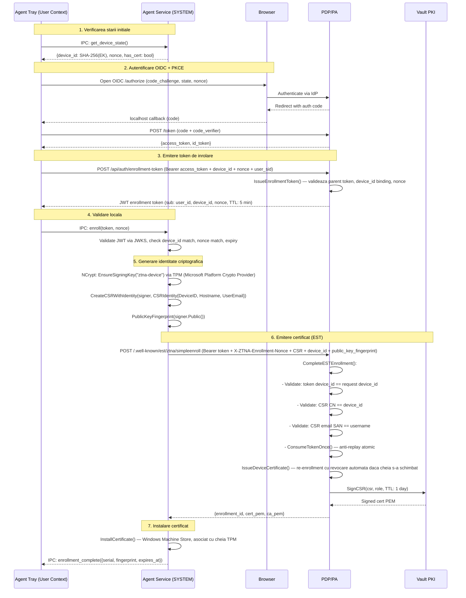
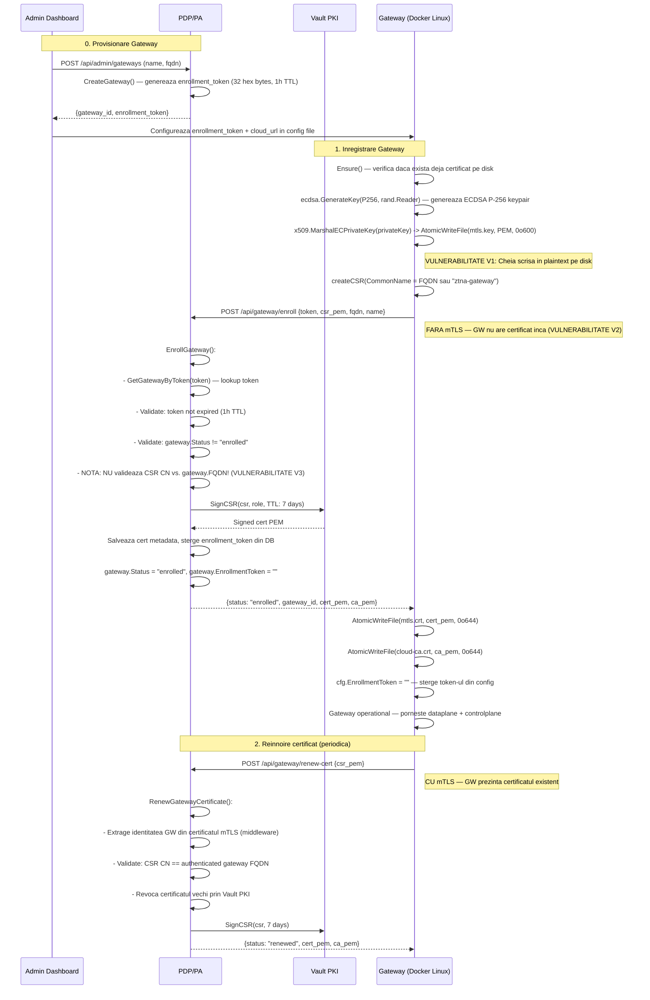

# ZTNA Enrollment Flow Security Analysis

## Agent & Gateway Enrollment — Thesis vs. Implementation & Vulnerability Assessment

---

## Cuprins

1. [Sumar Executiv](#1-sumar-executiv)
2. [Metodologie](#2-metodologie)
3. [Fluxul de Enrollare al Agentului](#3-fluxul-de-enrollare-al-agentului)
   - 3.1 [Fluxul din teoretic (documentul de licență)](#31-fluxul-teoretic)
   - 3.2 [Implementarea reală](#32-implementarea-reală)
   - 3.3 [Puncte forte](#33-puncte-forte)
   - 3.4 [Goluri identificate](#34-goluri-identificate)
4. [Fluxul de Enrollare al Gateway-ului](#4-fluxul-de-enrollare-al-gateway-ului)
   - 4.1 [Fluxul teoretic](#41-fluxul-teoretic)
   - 4.2 [Implementarea reală](#42-implementarea-reală)
   - 4.3 [Puncte forte](#43-puncte-forte)
   - 4.4 [Vulnerabilități identificate](#44-vulnerabilitati-identificate)
5. [Matricea de Evaluare a Vulnerabilităților](#5-matricea-de-evaluare-a-vulnerabilitatilor)
6. [Îmbunătățiri Propuse](#6-imbunatatiri-propuse)
7. [Plan de Acțiune](#7-plan-de-actiune)

---

## 1. Sumar Executiv

Această analiză compară fluxurile de înrolare descrise în documentul de licență (`Soluţie securizată de acces distant la resurse cu autentificare multifactor.md`) cu implementarea reală din codul Go al componentelor **Agent**, **Gateway** și **PDP/PA**.

**Concluzie generală**: Fluxul de înrolare al Agentului este robust, cu multiple straturi de apărare (TPM, OIDC+PKCE, anti-replay, CSR validation). Fluxul Gateway-ului are **2 vulnerabilități reale** care necesită remediere (enrollment fără mTLS, lipsă validare CSR CN). Stocarea cheii private plaintext cu `0o600` (V1) este **acceptată ca baseline** — este practica standard în industrie (NGINX, HAProxy, Caddy, Envoy).

---

## 2. Metodologie

Analiza a fost efectuată prin:

1. **Lectura documentului de licență** — secțiunile relevante pentru Agent (rândurile 39-85) și Gateway (rândurile 179-185)
2. **Inspecția codului sursă** — toate fișierele relevante din `agent/internal/enrollment/`, `gateway/internal/enrollment/`, `pdp/pa/enrollment/`, `pdp/pa/gateway/`, `pdp/pa/transport/`
3. **Modelarea fluxurilor** — diagrame de secvență care compară fluxul teoretic cu cel implementat
4. **Evaluarea vulnerabilităților** — fiecare gap identificat a fost clasificat după severitate, exploitabilitate și impact

---

## 3. Fluxul de Enrollare al Agentului

### 3.1 Fluxul Teoretic

Conform documentului de licență (rândurile 39-85), înrolarea Agentului parcurge 7 etape:

1. **Verificarea stării inițiale** — Tray interoghează Service prin IPC pentru a determina dacă dispozitivul este deja înrolat
2. **Identificarea dispozitivelor neînrolate** — Service expune `device_id` (SHA-256 din Endorsement Key) și `nonce`
3. **Autentificarea utilizatorului** — OIDC Authorization Code Flow cu PKCE
4. **Emiterea tokenului de înrolare** — JWT cu scop strict, durată redusă, care conține identitatea utilizatorului + device_id + context sesiune
5. **Validarea locală** — Service validează JWT prin JWKS, verifică integritatea, expirarea, device_id și nonce
6. **Generarea identității criptografice** — NCrypt cu `Microsoft Platform Crypto Provider` (TPM 2.0), CSR cu device_id + informații de identificare
7. **Emiterea și instalarea certificatului** — PDP intermediază semnarea prin Vault PKI, certificatul e instalat în Windows Machine Store

### 3.2 Implementarea Reală



### 3.3 Puncte Forte

| # | Control de Securitate | Detaliu | Fișier:Linie |
|---|----------------------|---------|-------------|
| 1 | **TPM-anchored keys** | Cheia privată nu părăsește niciodată TPM-ul; NCrypt cu `Microsoft Platform Crypto Provider`. Cheia e creată cu `createMachineSigningKey()` și semnătura e făcută prin `signHash()` direct în TPM | [`key_windows.go:121-154`](../agent/internal/deviceidentity/key_windows.go:121), [`key_windows.go:183-216`](../agent/internal/deviceidentity/key_windows.go:183) |
| 2 | **OIDC + PKCE** | Authorization Code Flow cu PKCE — previne authorization code injection; code_verifier/code_challenge generat de Tray | Document licență §Autentificarea utilizatorului |
| 3 | **JWT enrollment token cu binding** | Token generat de `IssueEnrollmentToken()` conține: `sub`=user_id, `device_id`, `nonce`, `user_sid`. Token-ul părinte trebuie să aibă `Purpose=""` (nu poate fi un alt enrollment token) | [`service.go:420-469`](../pdp/pa/enrollment/service.go:420) |
| 4 | **Anti-replay la nivel DB** | `ConsumeTokenOnce()` — operație atomică care marchează token-ul ca utilizat; a doua utilizare primește `ErrTokenAlreadyUsed` | [`service.go:406-418`](../pdp/pa/enrollment/service.go:406) |
| 5 | **Nonce binding** | `X-ZTNA-Enrollment-Nonce` header verificat contra `claims.Nonce` din JWT — previne reutilizarea token-ului într-o sesiune diferită | [`router.go:3502-3503`](../pdp/pa/transport/router.go:3502) |
| 6 | **CSR validation multi-nivel** | CN == device_id, email SAN == username (validat prin `ValidateCSREmailIdentity`), component normalization | [`service.go:384-389`](../pdp/pa/enrollment/service.go:384) |
| 7 | **Device-user binding** | `SaveDeviceUser()` asociază device-ul cu utilizatorul care l-a înrolat (rol: "owner") | [`service.go:621-629`](../pdp/pa/enrollment/service.go:621) |
| 8 | **IPC securizat** | Named Pipes cu ACL între Tray (user context) și Service (SYSTEM context) — previne atacuri de impersonare locală | [`pipe_acl.go`](../agent/internal/ipc/pipe_acl.go) |
| 9 | **Validare locală JWKS** | Service validează JWT prin JWKS înainte de a trimite CSR-ul către PDP — previne trimiterea de CSR-uri cu token-uri invalide | Document licență §Validarea locală |
| 10 | **Re-enrollment cu key rotation automată** | Dacă același device re-înrolează cu o cheie nouă, `IssueDeviceCertificate()` revocă automat vechiul certificat prin Vault PKI | [`service.go:571-583`](../pdp/pa/enrollment/service.go:571) |
| 11 | **Reînnoire prin mTLS** | `RenewWithMTLS()` folosește certificatul existent pentru autentificare mutuală; `RenewDeviceCertificate()` verifică `PublicKeyFingerprint` — previne reînnoirea cu o cheie diferită | [`renewal.go:24-42`](../agent/internal/enrollment/renewal.go:24), [`service.go:674-677`](../pdp/pa/enrollment/service.go:674) |

### 3.4 Goluri Identificate

| # | Gap | Severitate | Descriere | Recomandare |
|---|-----|-----------|-----------|-------------|
| **G1** | Certificat valid doar 1 zi | 🟡 Mediu | `endpointCertificateValidityDays = 1` — dacă bucla de reînnoire eșuează >1 zi (ex: device offline, PDP offline), device-ul pierde identitatea mTLS și necesită re-înrolare completă cu OIDC | Acceptabil cu monitorizare: adaugă metrici Prometheus pentru expirări și un mecanism de retry exponential backoff |
| **G2** | Reînnoirea necesită aceeași cheie | 🟡 Mediu | `RenewDeviceCertificate()` verifică `PublicKeyFingerprint` — dacă cheia TPM se corupe (rar, dar posibil), reînnoirea eșuează și necesită re-înrolare completă | Acceptabil: coruperea TPM e extrem de rară; re-înrolarea e fluxul corect în acest caz |
| **G3** | Lipsă pinning certificat PDP | 🟡 Mediu | La enrollment, Agentul nu face pinning al certificatului PDP-ului; nu există un mecanism de verificare că PDP-ul e cel așteptat | Adaugă `CA_FINGERPRINT` salvat la primul enrollment și verificat la conexiunile ulterioare. Vezi secțiunea 6.3 |

---

## 4. Fluxul de Enrollare al Gateway-ului

### 4.1 Fluxul Teoretic

Conform documentului de licență (rândurile 179-185):

1. Gateway-ul este provisionat de administrator și primește un **token unic de înrolare, cu valabilitate limitată**
2. Gateway-ul **generează o pereche de chei criptografice** și construiește un **CSR**
3. CSR-ul este transmis către **infrastructura PKI** a platformei, unde este validat și semnat
4. Certificatul rezultat este asociat identității Gateway-ului și utilizat pentru mTLS

### 4.2 Implementarea Reală



### 4.3 Puncte Forte

| # | Control de Securitate | Detaliu | Fișier:Linie |
|---|----------------------|---------|-------------|
| 1 | **Token one-time** | Enrollment token-ul e șters din DB după enrollment (`gateway.EnrollmentToken = ""`); `gateway.Status == "enrolled"` blochează reutilizarea | [`service.go:318-319`](../pdp/pa/gateway/service.go:318), [`service.go:303-304`](../pdp/pa/gateway/service.go:303) |
| 2 | **Token cu TTL scurt** | `gatewayEnrollmentTokenTTL = 1 oră` — fereastră limitată pentru compromitere; token-ul e generat cu `randomHex(16)` (128 biți entropie) | [`service.go`](../pdp/pa/gateway/service.go) |
| 3 | **Rate limiting pe enrollment** | `checkEnrollRateLimit(ip)` previne brute-force pe endpoint-ul de enrollment | [`router.go:3883`](../pdp/pa/transport/router.go:3883) |
| 4 | **Reînnoire prin mTLS** | `handleGatewayRenewCert` extrage identitatea Gateway-ului din certificatul mTLS (setat de `gatewayAuthMiddleware`) | [`router.go:3948-3952`](../pdp/pa/transport/router.go:3948) |
| 5 | **Validare CSR CN la reînnoire** | `csr.Subject.CommonName != gateway.FQDN` — previne impersonarea altui Gateway | [`service.go:355-356`](../pdp/pa/gateway/service.go:355) |
| 6 | **Revocare certificat vechi la reînnoire** | `s.revoker(oldSerial, oldCertPEM, ...)` — vechiul certificat e revocat prin Vault PKI | [`service.go:380-382`](../pdp/pa/gateway/service.go:380) |
| 7 | **TLS 1.3 minim** | `tls.Config{MinVersion: tls.VersionTLS13}` pe clientul HTTP de enrollment | [`enrollment.go:167`](../gateway/internal/enrollment/enrollment.go:167) |
| 8 | **Ștergere token din config după enrollment** | `cfg.EnrollmentToken = ""` — token-ul nu persistă în fișierul de configurare după utilizare | [`enrollment.go:134`](../gateway/internal/enrollment/enrollment.go:134) |
| 9 | **Scriere atomică** | `AtomicWriteFile()` folosește temp file + rename pentru a preveni coruperea fișierelor de certificat/cheie | [`config.go:152`](../gateway/internal/config/config.go:152) |

### 4.4 Vulnerabilități Identificate

#### ✅ V1: Cheia Privată Plaintext — Acceptat (Industry Baseline)

- **Severitate**: ACCEPTAT (nu necesită remediere imediată)
- **Fișier**: [`enrollment.go:64-69`](../gateway/internal/enrollment/enrollment.go:64), [`server.go:651-658`](../gateway/internal/dataplane/server.go:651)
- **Descriere**: După generarea perechii de chei ECDSA P-256, cheia privată este salvată pe disk cu `AtomicWriteFile(cfg.MTLSKey, ..., 0o600)`. Aceasta este **practica standard în industrie**:

| Soluție Enterprise | Unde e cheia? | Format | Protecție |
|---|---|---|---|
| **NGINX** | `/etc/nginx/ssl/server.key` | Plaintext PEM | `0o600`, root-only, SELinux |
| **Envoy Proxy** | Kubernetes Secret → tmpfs | Plaintext PEM | tmpfs (RAM-only) |
| **HAProxy** | `/etc/haproxy/ssl/server.key` | Plaintext PEM | `0o400`, root-only |
| **Traefik** | Kubernetes Secret / file provider | Plaintext PEM | tmpfs + RBAC |
| **Caddy** | `~/.local/share/caddy/` | Plaintext PEM | `0o600`, user dedicat |
| **Cloudflare Tunnel** | `~/.cloudflared/cert.pem` | Plaintext PEM | `0o600`, user dedicat |
| **Istio sidecar** | Montat de istiod → tmpfs | Plaintext PEM | tmpfs, rotație la 24h |
| **Consul Connect** | Generat de Consul → disk | Plaintext PEM | Permisiuni + rotație frecventă |

Protecția în industrie vine din straturi complementare:
- **SELinux/AppArmor** — mandatory access control (doar procesul autorizat citește fișierul)
- **tmpfs** (Kubernetes) — fișierul există doar în RAM, nu pe persistent disk
- **Rotație frecventă** — certificatul expiră rapid, fereastra de atac e limitată
- **Container izolat + non-root** — procesul rulează cu user dedicat, fără privilegii

În contextul acestei arhitecturi:
- Gateway-ul rulează ca user non-root (`appuser`) într-un container Docker izolat
- Permisiunile `0o600` limitează accesul la procesul Gateway
- Certificatul e valabil 7 zile — fereastra de atac e limitată
- Cheia e scrisă și în [`server.go:651-658`](../gateway/internal/dataplane/server.go:651) la reînnoire — același standard `0o600`

- **Decizie**: Nu se implementează Vault Transit pentru Gateway în această fază. Se păstrează plaintext `0o600` ca baseline acceptabil, aliniat cu practica industriei. Vault Transit rămâne opțiunea de upgrade pentru o iterație viitoare (Enterprise-grade).

- **Justificare tehnică**: Dacă un atacator obține acces la citirea fișierelor din containerul Gateway, impactul depășește cu mult furtul cheii private — atacatorul poate deja modifica configurația, intercepta traficul, sau exfiltra date. În acel punct, criptarea cheii oferă protecție marginală (atacatorul trebuie doar să aștepte până când cheia e decriptată în memorie la următoarea pornire).

#### 🟠 V2: Enrollment fără mTLS

- **Severitate**: ÎNALTĂ
- **Fișier**: [`router.go:3875-3916`](../pdp/pa/transport/router.go:3875), [`enrollment.go:87-91`](../gateway/internal/enrollment/enrollment.go:87)
- **Descriere**: `POST /api/gateway/enroll` este singurul endpoint operațional care nu necesită mTLS. Justificarea este corectă arhitectural — Gateway-ul nu are încă un certificat cu care să se autentifice. Totuși, asta înseamnă că:
  - Un atacator care obține token-ul de enrollment (de exemplu, din variabile de mediu Docker, config file, sau loguri) poate înrola un Gateway malițios
  - Nu există o a doua verificare a identității Gateway-ului (de exemplu, IP sursă, TLS-SNI, fingerprint CSR pre-înregistrat)
  - Token-ul e singurul factor de autentificare

- **Impact**: Un atacator cu token-ul de enrollment poate:
  1. Înrola un Gateway sub controlul său
  2. Primi sesiuni provisionate de PA
  3. Intercepta traficul dintre Agent și resursele interne

- **Remediere**: Vezi secțiunea 6.2 — strategie multi-nivel: hashing token, fingerprint CSR pre-înregistrat, verificare IP/FQDN.

#### 🟠 V3: Lipsă Validare CSR CommonName la Enrollment

- **Severitate**: ÎNALTĂ
- **Fișier**: [`service.go:286-338`](../pdp/pa/gateway/service.go:286)
- **Descriere**: `EnrollGateway()` nu validează că `csr.Subject.CommonName` corespunde cu `gateway.FQDN` sau cu `req.FQDN`. La reînnoire, această validare există (linia 355-356), dar lipsește la enrollment-ul inițial. Un atacator cu token valid poate:
  - Prezenta un CSR cu `CN=alt-gateway.internal` și obține un certificat pentru un FQDN arbitrar
  - Efectua un atac de tip "confused deputy" unde Gateway-ul primește un certificat pentru altă identitate

- **Impact**: Posibilitatea de a obține un certificat pentru un CN arbitrar subminează modelul de identitate al Gateway-ului.

- **Remediere**: Adăugarea a 3 linii de cod în `EnrollGateway()` — vezi secțiunea 6.2.2.

#### 🟡 V4: Lipsă Pinning CA la Enrollment

- **Severitate**: MEDIE
- **Fișier**: [`enrollment.go:166-181`](../gateway/internal/enrollment/enrollment.go:166)
- **Descriere**: La enrollment, Gateway-ul construiește un client HTTP cu `tls.Config{RootCAs: pool}` doar dacă fișierul `CloudCA` există deja pe disk. Dacă nu există (cazul tipic la primul enrollment), clientul folosește system trust store. Un atacator cu capacități de MITM pe LAN în momentul enrollment-ului ar putea:
  - Prezenta un certificat semnat de o CA din system trust store
  - Intercepta token-ul de enrollment și CSR-ul
  - Înrola un Gateway malițios

- **Impact**: Interceptarea enrollment-ului permite furtul token-ului și al identității Gateway-ului.

- **Remediere**: Adăugarea unui mecanism de pinning — vezi secțiunea 6.3.

#### 🟡 V5: Certificat Valid Doar 7 Zile

- **Severitate**: MEDIE
- **Fișier**: [`service.go`](../pdp/pa/gateway/service.go) — `gatewayCertificateValidityDays = 7`
- **Descriere**: Similar cu G1 la Agent — dacă bucla de reînnoire eșuează mai mult de 7 zile (ex: PDP offline, probleme de rețea), Gateway-ul pierde identitatea mTLS. Spre deosebire de Agent, Gateway-ul nu poate face re-înrolare automată (necesită intervenția admin-ului pentru un nou enrollment token).

- **Impact**: Gateway-ul devine inoperabil până la intervenția manuală a admin-ului.

- **Remediere**: Acceptabil cu monitorizare; se poate adăuga un mecanism de notificare proactivă când certificatul se apropie de expirare.

---

## 5. Matricea de Evaluare a Vulnerabilităților

| ID | Componentă | Vulnerabilitate | Severitate | Exploitabilitate | Impact | Status |
|----|-----------|----------------|------------|------------------|--------|--------|
| **V1** | Gateway | Cheie privată plaintext pe disk (0o600) | ✅ ACCEPTAT | Medie (necesită acces la container/volum) | Compromitere identitate Gateway | **Industry baseline — NGINX/HAProxy/Caddy standard** |
| **V2** | Gateway | Enrollment fără mTLS | 🟠 HIGH | Medie (necesită token) | Gateway malițios înrolat, interceptare trafic | **De implementat** |
| **V3** | Gateway | Lipsă validare CSR CN la enrollment | 🟠 HIGH | Scăzută-Medie (necesită token valid) | Certificat pentru CN arbitrar | **De implementat** |
| **V4** | Gateway | Lipsă pinning CA | 🟡 MEDIUM | Scăzută (necesită MITM pe LAN) | Interceptare enrollment, furt token | **De implementat** |
| **V5** | Gateway | Certificat 7 zile | 🟡 MEDIUM | N/A (risc operațional) | Gateway dezactivat la expirare | Acceptabil cu monitorizare |
| **G1** | Agent | Certificat 1 zi | 🟡 MEDIUM | N/A (risc operațional) | Device dezactivat la expirare | Acceptabil cu monitorizare |
| **G2** | Agent | Reînnoire necesită aceeași cheie | 🟡 MEDIUM | N/A (risc operațional) | Re-înrolare necesară la corupere TPM | Acceptabil (rar) |
| **G3** | Agent | Lipsă pinning CA | 🟡 MEDIUM | Scăzută (necesită MITM pe LAN) | Interceptare enrollment, furt token | **De implementat** |

---

## 6. Îmbunătățiri Propuse

### 6.1 V1: Cheia Privată Plaintext — Acceptat (Industry Baseline)

**Decizie**: V1 nu se remediază în această fază. Se păstrează `AtomicWriteFile(mtlsKey, PEM, 0o600)` ca baseline acceptabil.

**Justificare**:

1. **Industry precedent**: NGINX, HAProxy, Caddy, Envoy, Traefik, Cloudflare Tunnel — toate salvează cheile private plaintext cu `0o600`. Nu există audit de securitate care să considere asta o vulnerabilitate când permisiunile sunt corecte.

2. **Threat model real**: Dacă un atacator poate citi fișiere din container-ul Gateway (necesită execuție de cod sau acces la host), impactul depășește furtul cheii: atacatorul poate modifica configurația, intercepta traficul live, sau instala un rootkit. Criptarea cheii ar oferi doar protecție marginală în acest scenariu (atacatorul trebuie doar să aștepte până la următoarea pornire când cheia e decriptată în RAM).

3. **Upgrade path (viitor)**: Dacă se dorește Enterprise-grade security într-o iterație viitoare:
   - **Vault Transit direct** din Gateway (NU prin PDP) — Gateway-ul vorbește direct cu Vault Transit, eliminând necesitatea ca PDP-ul să vadă cheia. Vezi analiza detaliată în sesiunea de planificare.
   - Token Vault cu scope limitat: doar `transit/encrypt` + `transit/decrypt` pe `ztna-gateway-key`
   - Fallback AES-256-GCM din `/etc/machine-id` + Argon2id pentru cazul în care Vault e offline

**Acțiune imediată**: Niciuna. Codul existent din [`enrollment.go:64-69`](../gateway/internal/enrollment/enrollment.go:64) și [`server.go:651-658`](../gateway/internal/dataplane/server.go:651) este corect și aliniat cu practica industriei.

### 6.2 V2+V3: Securizare Enrollment Gateway

#### 6.2.1 Token Hashing (V2 partea 1)

În loc să se compare token-ul în plaintext, se stochează `SHA-256(enrollment_token)` în DB:

```go
// În CreateGateway():
tokenPlaintext, _ := randomHex(16)        // 32 hex chars = 128 biți entropie
tokenHash := sha256Hex(tokenPlaintext)     // 64 hex chars
gateway.EnrollmentToken = tokenHash        // stocat în DB
// Se returnează tokenPlaintext admin-ului (singura dată când e vizibil)

// În EnrollGateway():
tokenHash := sha256Hex(req.Token)
gateway, found := s.store.GetGatewayByTokenHash(tokenHash)
```

**Beneficii**: Token-ul real nu e niciodată stocat; un DB leak nu expune token-uri utilizabile.

#### 6.2.2 Validare CSR CN (V3)

Adăugarea a 3-5 linii în [`EnrollGateway()`](../pdp/pa/gateway/service.go:286):

```go
// După parsarea CSR-ului (înainte de signer):
csr, err := parseGatewayCSR(req.CSRPEM)
if err != nil {
    return nil, err
}
expectedCN := firstNonEmpty(req.FQDN, gateway.FQDN)
if expectedCN != "" && csr.Subject.CommonName != expectedCN {
    return nil, fmt.Errorf("%w: CSR CommonName %q does not match gateway FQDN %q", ErrInvalidCSR, csr.Subject.CommonName, expectedCN)
}
```

**Beneficii**: Previne obținerea unui certificat pentru un CN arbitrar; aliniază enrollment-ul cu reînnoirea (care deja are această validare).

#### 6.2.3 Fingerprint CSR Pre-înregistrat (V2 partea 2, opțional)

La generarea token-ului de enrollment, admin-ul poate opțional include un `csr_fingerprint` așteptat:

```go
// În CreateGateway():
gateway.ExpectedCSRFingerprint = req.CSRSHA256 // opțional

// În EnrollGateway():
if gateway.ExpectedCSRFingerprint != "" {
    actualFingerprint := sha256Hex(csr.Raw)
    if actualFingerprint != gateway.ExpectedCSRFingerprint {
        return nil, fmt.Errorf("%w: CSR fingerprint mismatch", ErrInvalidCSR)
    }
}
```

### 6.3 V4+G3: Pinning CA

Adăugarea unui mecanism de pinning al CA la primul enrollment:

```go
// La enrollment (Agent și Gateway), după primirea CA PEM:
caFingerprint := sha256Hex(caPEM)
// Salvează lângă certificat: certs/cloud-ca.sha256
AtomicWriteFile(caFingerprintPath, []byte(caFingerprint), 0o644)

// La conexiunile ulterioare:
savedFingerprint, _ := os.ReadFile(caFingerprintPath)
if savedFingerprint != nil {
    // Verifică CA prezentată contra fingerprint salvat
    tlsConfig.VerifyPeerCertificate = func(rawCerts [][]byte, _ [][]*x509.Certificate) error {
        // ... verifică lanțul și CA fingerprint
    }
}
```

### 6.4 V5+G1: Monitorizare Expirare Certificate

Adăugarea de metrici Prometheus și loguri proactive:

```go
// În bucla de reînnoire:
expiresIn := cert.NotAfter.Sub(time.Now())
if expiresIn < 24*time.Hour {
    log.Printf("[WARN] Certificate expires in %v", expiresIn)
    metrics.CertExpiryGauge.Set(expiresIn.Seconds())
}
if expiresIn < 1*time.Hour {
    log.Printf("[CRITICAL] Certificate expires in %v — forcing renewal", expiresIn)
}
```

---

## 7. Plan de Acțiune

### Ordinea Implementării

| Prioritate | Task | Dependențe | Complexitate |
|-----------|------|-----------|-------------|
| **1** | V3: Validare CSR CN la enrollment (3 linii) | Niciuna | 🟢 Minimală |
| **2** | V2: Token hashing (SHA-256) | V3 | 🟡 Medie |
| **3** | V4+G3: Pinning CA | V2 | 🟡 Medie |
| **4** | Monitorizare expirare certificate | Niciuna | 🟢 Minimală |
| **5** | Curățare configurație și Docker (Phase 4) | Niciuna | 🟡 Medie |
| **6** | V1 (viitor): Vault Transit direct Gateway (opțional) | Niciuna | 🔴 Mare |

### Secvența Recomandată

```
Sesiunea 1: V3 + V2 (reparații rapide, ~50 linii total)
  ├── Adaugă validare CSR CN în EnrollGateway()
  └── Implementează token hashing (SHA-256) în CreateGateway() + EnrollGateway()

Sesiunea 2: V4 + G3 (pinning CA, ~100 linii)
  ├── Adaugă CA fingerprint salvare/verificare în enrollment Agent
  └── Adaugă CA fingerprint salvare/verificare în enrollment Gateway

Sesiunea 3: Monitorizare + Curățare configurație (~100 linii)
  ├── Adaugă metrici Prometheus și loguri proactive pentru expirare certificate
  ├── Elimină câmpuri redundante din config files
  ├── Asigură că toate componentele compilează cu config-uri curate
  └── Actualizează docker-compose.yml

Sesiunea 4 (viitor, opțional): Vault Transit direct pentru Gateway (~200 linii)
  ├── Gateway vorbește direct cu Vault Transit (NU prin PDP)
  ├── Token Vault cu scope limitat pe Gateway
  └── Fallback AES-256-GCM din machine-id + Argon2id
```

---

## Anexa A: Referințe Cod

| Fișier | Linii | Descriere |
|--------|-------|-----------|
| [`pdp/pa/enrollment/service.go`](../pdp/pa/enrollment/service.go) | 1-774 | Serviciul de enrollment — `CompleteESTEnrollment()`, `IssueEnrollmentToken()`, `ConsumeEnrollmentToken()`, `IssueDeviceCertificate()`, `RenewDeviceCertificate()` |
| [`pdp/pa/gateway/service.go`](../pdp/pa/gateway/service.go) | 1-532 | Serviciul Gateway — `EnrollGateway()`, `RenewGatewayCertificate()`, `CreateGateway()` |
| [`pdp/pa/transport/router.go`](../pdp/pa/transport/router.go) | 3447-3982 | HTTP handlers — `handleESTSimpleEnroll()`, `handleGatewayEnroll()`, `handleGatewayRenewCert()` |
| [`agent/internal/enrollment/runner.go`](../agent/internal/enrollment/runner.go) | 1-246 | Runner-ul de enrollment Agent — `Enroll()`, `Renew()` |
| [`agent/internal/enrollment/est.go`](../agent/internal/enrollment/est.go) | 1-125 | Client EST — `SimpleEnrollWithToken()` |
| [`agent/internal/enrollment/csr.go`](../agent/internal/enrollment/csr.go) | 1-71 | Generare CSR Agent — `CreateCSRWithIdentity()` |
| [`agent/internal/enrollment/renewal.go`](../agent/internal/enrollment/renewal.go) | 1-96 | Reînnoire certificat Agent — `RenewWithMTLS()` |
| [`agent/internal/deviceidentity/key_windows.go`](../agent/internal/deviceidentity/key_windows.go) | 1-289 | Gestiune chei TPM — `createMachineSigningKey()`, `signHash()` |
| [`gateway/internal/enrollment/enrollment.go`](../gateway/internal/enrollment/enrollment.go) | 1-200 | Enrollment Gateway — `Ensure()`, `createCSR()`, `enrollmentHTTPClient()` |
| [`gateway/internal/config/config.go`](../gateway/internal/config/config.go) | 1-219 | Configurație Gateway — `AtomicWriteFile()`, `ResolveSecretRefs()` |
