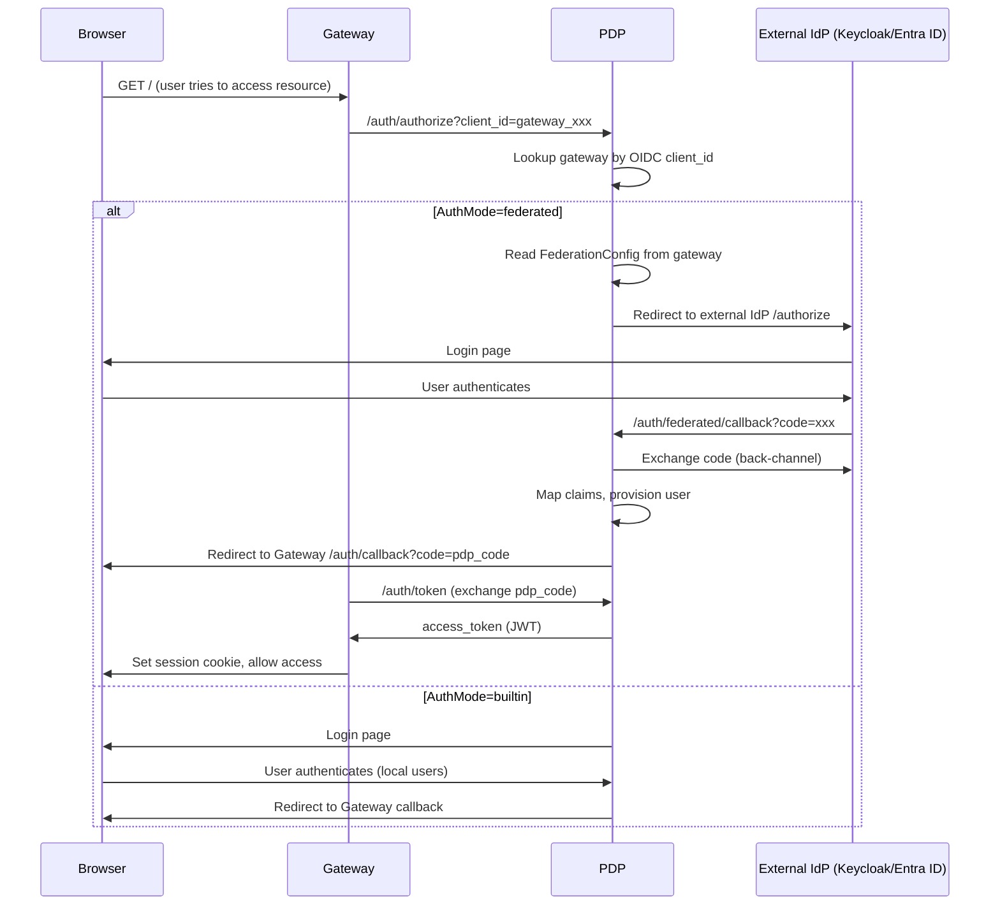
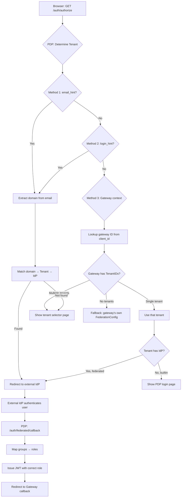

# IDP per Organization / Gateway — Architecture Analysis & Implementation Plan

## Cuprins

1. [Current State Assessment](#1-current-state-assessment)
2. [Gap Analysis](#2-gap-analysis)
3. [Recommended Architecture](#3-recommended-architecture)
4. [Home Realm Discovery (HRD) Design](#4-home-realm-discovery-hrd-design)
5. [Group-to-Role Mapping Design](#5-group-to-role-mapping-design)
6. [Migration Path](#6-migration-path)
7. [Implementation Checklist](#7-implementation-checklist)

---

## 1. Current State Assessment

### 1.1 Ce funcționează deja

Sistemul are deja o bază solidă pentru identity brokering:

| Componentă | Fișier | Status |
|-----------|--------|--------|
| `IdentityProvider` — orchestrator central de auth | [`pdp/idp/idp.go:19`](pdp/idp/idp.go:19) | ✅ Complet |
| `FederationProvider` — OIDC discovery, PKCE, code exchange, claim mapping | [`pdp/idp/federation.go:25`](pdp/idp/federation.go:25) | ✅ Complet |
| `OIDCManager` — OIDC authorization code flow, PKCE, refresh tokens | [`pdp/idp/oidc.go:34`](pdp/idp/oidc.go:34) | ✅ Complet |
| `FederationConfig` — stochează issuer, client_id, scopes, claim mapping per gateway | [`pdp/models/models.go:582`](pdp/models/models.go:582) | ✅ Complet |
| `Gateway.AuthMode` — builtin vs federated per gateway | [`pdp/models/models.go:571`](pdp/models/models.go:571) | ✅ Complet |
| Federated callback handler — `/auth/federated/callback` | [`pdp/pa/transport/router.go:2646`](pdp/pa/transport/router.go:2646) | ✅ Complet |
| Auto-provisioning federated users — `FindOrCreateFederatedUser` | [`pdp/idp/users.go:233`](pdp/idp/users.go:233) | ✅ Complet |
| Multi-tenant model — `Tenant` struct cu `TenantID` pe toate entitățile | [`pdp/models/models.go:102`](pdp/models/models.go:102) | ✅ Structură existentă |

### 1.2 Fluxul actual de federare



### 1.3 Probleme arhitecturale identificate

1. **FederationConfig e pe Gateway, nu pe Tenant**

   În [`models.Gateway`](pdp/models/models.go:542), `FederationConfig` este atașat direct gateway-ului:
   ```go
   type Gateway struct {
       // ...
       AuthMode         string            `json:"auth_mode"`
       FederationConfig *FederationConfig `json:"federation_config,omitempty"`
   }
   ```
   Aceasta înseamnă că:
   - Dacă două organizații distincte folosesc același gateway fizic (caz posibil în deployment-uri shared), nu pot avea IdP-uri diferite.
   - Logica de "care IdP deservește această organizație?" nu există deloc la nivel de tenant.

2. **Nu există Home Realm Discovery (HRD)**

   În momentul în care un utilizator lovește `/auth/authorize`, PDP:
   - Verifică dacă gateway-ul are `AuthMode=federated`
   - Dacă da, redirecționează **direct** către external IdP
   - Nu există niciun pas intermediar care să întrebe "din ce organizație faci parte?" sau "care este domeniul tău de email?"

   Aceasta este o problemă reală când:
   - Un gateway deservește mai multe organizații cu IdP-uri diferite
   - O organizație are mai multe IdP-uri (ex. angajați pe Entra ID, contractori pe Keycloak)
   - Se dorește un flux "bring your own IdP" pentru clienți enterprise

3. **Nu există Group → Role mapping**

   În [`federation.go`](pdp/idp/federation.go:217), `MapExternalClaims` extrage doar `sub`, `username`, și `email`:
   ```go
   // Default mappings
   mapping := map[string]string{
       "username": "preferred_username",
       "email":    "email",
   }
   ```
   Apoi în [`users.go:233`](pdp/idp/users.go:233), `FindOrCreateFederatedUser` setează **întotdeauna** `Role: "user"`:
   ```go
   user = &models.User{
       // ...
       Role:            "user",   // <-- hardcodat!
   }
   ```

   Nu există nicio mapare de grupuri externe → roluri interne (`admin`, `operator`, `auditor` etc.).

4. **Tenant-ul nu e legat de IdP**

   Structura [`Tenant`](pdp/models/models.go:102) nu are niciun câmp legat de Identity Provider:
   ```go
   type Tenant struct {
       ID          string
       Name        string
       Domain      string    // "company.com" — există dar nu e folosit pentru HRD
       Description string
       Enabled     bool
   }
   ```

   `Domain` este prezent dar complet neutilizat în logica de rutare a IdP-ului.

---

## 2. Gap Analysis

| # | Gap | Severity | Impact |
|---|-----|----------|--------|
| G1 | Federation config pe Gateway, nu pe Tenant | 🔴 High | Blochează multi-tenancy real cu IdP-uri diferite |
| G2 | Lipsă Home Realm Discovery | 🔴 High | Imposibil de rutat utilizatori la IdP-ul corect într-un scenariu multi-IdP |
| G3 | Lipsă group-to-role mapping | 🟡 Medium | Toți utilizatorii federated primesc `role=user`; imposibil de acordat privilegii de admin automat |
| G4 | `Tenant.Domain` neutilizat | 🟡 Medium | Câmpul există dar nu face nimic — ratăm o oportunitate de HRD simplu |
| G5 | `FederationConfig.ClaimMapping` suportă doar username/email | 🟢 Low | Structura e generică (`map[string]string`) dar doar aceste două chei sunt folosite |
| G6 | Nu se validează `issuer` în callback-ul federated | 🟢 Low | La callback, issuer-ul din `FederationConfig` e folosit doar pentru lookup, nu se verifică că `iss` din id_token se potrivește |

---

## 3. Recommended Architecture

### 3.1 Principii de design

1. **IdP-ul aparține Organizației (Tenant), nu Gateway-ului**
   - Fiecare tenant poate avea 0, 1 sau N Identity Provider-e configurate
   - Un gateway deservesște unul sau mai multe tenant-uri
   - Rezolvă G1

2. **Home Realm Discovery în 3 pași progresivi**
   - Pasul 1: Domeniu de email / subdomeniu (simplu, rapid)
   - Pasul 2: Determinare din contextul gateway + tenant
   - Pasul 3: Fallback — login page cu selector de organizație
   - Rezolvă G2

3. **Group mapping la nivel de IdP per tenant**
   - Fiecare IdP configurat per tenant poate avea reguli de mapare grup → rol
   - Maparea se aplică la fiecare login federated (nu doar la provisioning)
   - Rezolvă G3

### 3.2 Model nou de date

#### 3.2.1 Modificări la `Tenant`

```go
// Tenant — extended with IdP references
type Tenant struct {
    ID          string    `json:"id"`
    Name        string    `json:"name"`
    Domain      string    `json:"domain"`       // primary domain for HRD (e.g. "company.com")
    Domains     []string  `json:"domains"`       // additional verified domains for HRD
    Description string    `json:"description,omitempty"`
    Enabled     bool      `json:"enabled"`
    
    // Identity Provider reference
    DefaultIdPID string   `json:"default_idp_id,omitempty"` // points to IdentityProviderConfig.ID
    
    CreatedAt   time.Time `json:"created_at"`
    UpdatedAt   time.Time `json:"updated_at"`
}
```

#### 3.2.2 Entitate nouă: `IdentityProviderConfig`

```go
// IdentityProviderConfig defines an external IdP trusted by a tenant.
// Replaces FederationConfig being attached to Gateway — the IdP belongs
// to the organization, not the network infrastructure.
type IdentityProviderConfig struct {
    ID          string    `json:"id"`
    TenantID    string    `json:"tenant_id"`
    Name        string    `json:"name"`         // display name, e.g. "Company Entra ID"
    Type        string    `json:"type"`         // "oidc" (future: "saml", "ldap")
    Enabled     bool      `json:"enabled"`
    
    // HRD: which email domains route to this IdP
    Domains     []string  `json:"domains"`      // e.g. ["company.com", "subsidiary.com"]
    
    // OIDC configuration (identical to FederationConfig, just moved)
    Issuer        string            `json:"issuer"`
    ClientID      string            `json:"client_id"`
    ClientSecret  string            `json:"client_secret,omitempty"`
    Scopes        string            `json:"scopes"`
    AutoDiscovery bool              `json:"auto_discovery"`
    
    // Advanced claim mapping
    ClaimMapping  map[string]string `json:"claim_mapping,omitempty"`
    // e.g. {"username": "preferred_username", "email": "email", "groups": "groups"}
    
    // Group → Role mapping rules
    GroupRoleMapping []GroupRoleRule `json:"group_role_mapping,omitempty"`
    
    CreatedAt   time.Time `json:"created_at"`
    UpdatedAt   time.Time `json:"updated_at"`
}

// GroupRoleRule maps an external IdP group to an internal role
type GroupRoleRule struct {
    GroupName string `json:"group_name"` // external group name/ID from the IdP
    Role      string `json:"role"`       // internal role: "admin", "user", "operator"
}
```

#### 3.2.3 Modificări la `Gateway`

```go
type Gateway struct {
    // ... existing fields unchanged ...
    
    // DEPRECATED: FederationConfig moves to IdentityProviderConfig per tenant
    // AuthMode and FederationConfig are kept for backward compatibility
    // during migration, but should not be used for new configurations.
    AuthMode         string            `json:"auth_mode"`
    FederationConfig *FederationConfig `json:"federation_config,omitempty"` // deprecated — use tenant's IdP
    
    // NEW: Which tenants does this gateway serve?
    // If empty, behaves as before (single-tenant, backward compatible).
    TenantIDs        []string          `json:"tenant_ids,omitempty"`
}
```

#### 3.2.4 Actualizare `FederationSession`

```go
type FederationSession struct {
    ID            string    `json:"id"`
    OIDCSessionID string    `json:"oidc_session_id"`
    GatewayID     string    `json:"gateway_id"`
    TenantID      string    `json:"tenant_id"`     // NEW: which tenant's IdP is being used
    IdPID         string    `json:"idp_config_id"` // NEW: which IdentityProviderConfig
    Issuer        string    `json:"issuer"`
    PKCEVerifier  string    `json:"pkce_verifier"`
    Nonce         string    `json:"nonce"`
    State         string    `json:"state"`
    CreatedAt     time.Time `json:"created_at"`
    ExpiresAt     time.Time `json:"expires_at"`
}
```

### 3.3 Flow nou: Home Realm Discovery



### 3.4 Procesul de HRD în detaliu

HRD-ul se face în 3 pași progresivi:

**Pasul 1 — Email domain discovery (cel mai precis)**

Când un request `/auth/authorize` vine cu parametrul `login_hint=user@company.com`:
1. Se extrage domeniul: `company.com`
2. Se caută în toate [`IdentityProviderConfig.Domains`](pdp/models/models.go_new) un IdP care listează acest domeniu
3. Dacă se găsește un singur IdP → redirect direct la external IdP
4. Dacă se găsesc mai multe → se alege cel care aparține tenant-ului gateway-ului
5. Dacă nu se găsește niciunul → Pasul 2

**Pasul 2 — Gateway context discovery**

Gateway-ul știe din configurația proprie ce tenant deservește:
1. Se extrage `tenant_id` implicit din ruta gateway-ului (subdomeniu, path, header)
2. Se verifică `Tenant.DefaultIdPID`
3. Dacă tenant-ul are un singur IdP → redirect direct
4. Dacă tenant-ul are mai multe IdP-uri → se arată o pagină de selecție

**Pasul 3 — User-driven selection (fallback)**

Se afișează o pagină simplă care:
1. Arată logo-ul și numele organizației
2. Cere email-ul utilizatorului (doar domeniul e folosit pentru rutare)
3. Sau afișează butoane de "Sign in with X" pentru fiecare IdP disponibil
4. După selecție, se face redirect la IdP-ul corect

### 3.5 Group → Role Mapping

#### Flow

1. La callback-ul federated, după ce s-a primit `id_token` de la external IdP
2. Se parsează claim-ul de grupuri (configurabil prin `ClaimMapping["groups"]`, default: `"groups"`)
3. Pentru fiecare grup din token, se verifică [`GroupRoleMapping`](pdp/models/models.go_new) din `IdentityProviderConfig`
4. Se aplică regula cu cea mai înaltă prioritate (ex. "Domain Admins" → `admin` are prioritate peste "Users" → `user`)
5. Rolul rezultat este setat pe utilizator la [`FindOrCreateFederatedUser`](pdp/idp/users.go:233)
6. La fiecare login ulterior, maparea de grupuri se re-evaluează (rolul se poate schimba dacă utilizatorul a fost adăugat/scos dintr-un grup)

#### Prioritatea mapărilor

```
1. "admin"    → dacă user-ul e în orice grup mapat la admin
2. "operator" → dacă user-ul e în orice grup mapat la operator  
3. "auditor"  → dacă user-ul e în orice grup mapat la auditor
4. "user"     → fallback implicit
```

---

## 4. Home Realm Discovery (HRD) Design

### 4.1 Strategia de HRD

Există 3 abordări principale, în ordinea complexității:

| Metodă | Descriere | Complexitate | Experiență utilizator |
|--------|-----------|-------------|----------------------|
| **Domain-based** | Domeniul de email dictează IdP-ul | 🔵 Simplă | 🔵 Automată (fără prompt) |
| **Gateway-context** | Gateway-ul știe ce tenant deservește | 🔵 Simplă | 🔵 Automată |
| **User-picker** | Utilizatorul selectează organizația | 🟡 Medie | 🟡 Un pas extra |

**Recomandare**: Implementăm toate 3, cu fallback în cascadă.

### 4.2 Domain-based HRD — implementare

Endpoint-ul `/auth/authorize` va suporta un nou parametru Query String:

| Parametru | Descriere | Exemplu |
|-----------|-----------|---------|
| `login_hint` | Email sau identificator utilizator | `user@company.com` |
| `tenant_id` | ID-ul explicit al tenant-ului | `tenant_abc123` |
| `idp_id` | ID-ul explicit al IdP-ului | `idp_xyz789` |

Logica în [`handleOIDCAuthorize`](pdp/pa/transport/router.go:2515):

```go
func (s *Server) resolveIdentityProvider(r *http.Request, clientID string) (*models.IdentityProviderConfig, *models.Tenant, error) {
    // 1. Explicit idp_id → direct lookup
    if idpID := r.URL.Query().Get("idp_id"); idpID != "" {
        return s.pa.Store.GetIdentityProviderConfig(idpID)
    }
    
    // 2. Domain-based HRD via login_hint
    if loginHint := r.URL.Query().Get("login_hint"); loginHint != "" {
        domain := extractDomain(loginHint)
        if idp := s.pa.Store.FindIdPByDomain(domain); idp != nil {
            return idp, s.pa.Store.GetTenant(idp.TenantID)
        }
    }
    
    // 3. Gateway context → single tenant
    gw, _ := s.pa.Store.GetGatewayByOIDCClientID(clientID)
    if gw != nil && len(gw.TenantIDs) == 1 {
        tenant, _ := s.pa.Store.GetTenant(gw.TenantIDs[0])
        if tenant != nil {
            if idp := s.pa.Store.GetDefaultIdPForTenant(tenant.ID); idp != nil {
                return idp, tenant
            }
        }
    }
    
    // 4. Fallback: legacy gateway-level FederationConfig
    if gw != nil && gw.AuthMode == "federated" && gw.FederationConfig != nil {
        return legacyConfigToIdP(gw.FederationConfig), nil
    }
    
    // 5. Builtin auth
    return nil, nil, nil
}
```

### 4.3 Tenant/IdP picker page

Când HRD-ul automat eșuează (multiple posibilități sau niciuna), server-ul arată o pagină de selecție. Aceasta poate fi:

- **Simplă**: Un formular care cere adresa de email → se extrage domeniul → HRD domain-based
- **Avansată**: O listă de butoane "Sign in with X" pentru fiecare IdP disponibil în tenant-ul gateway-ului

---

## 5. Group-to-Role Mapping Design

### 5.1 Extragerea grupurilor din id_token

Modificare în [`MapExternalClaims`](pdp/idp/federation.go:217):

```go
type FederatedClaims struct {
    Subject  string   `json:"sub"`
    Username string   `json:"username"`
    Email    string   `json:"email"`
    Groups   []string `json:"groups"` // NEW
}
```

Mapping-ul se face prin `ClaimMapping["groups"]` (default: `"groups"`), cu suport pentru:
- Array de string-uri: `["Domain Admins", "Engineering"]`
- String cu separatori: `"Domain Admins,Engineering"` (split by comma, configurable)

### 5.2 Aplicarea mapării

Funcție nouă în [`idp/federation.go`](pdp/idp/federation.go):

```go
func (fp *FederationProvider) MapGroupsToRole(
    groups []string, 
    mapping []models.GroupRoleRule,
) string {
    // Iterate in priority order: admin > operator > auditor > user
    for _, rule := range mapping {
        for _, g := range groups {
            if strings.EqualFold(g, rule.GroupName) {
                return rule.Role
            }
        }
    }
    return "user" // default
}
```

### 5.3 Integrare în flow-ul de callback

În [`handleFederatedCallback`](pdp/pa/transport/router.go:2646), după `MapExternalClaims`:

```go
// Determine role from group mapping
role := "user"
if idpConfig != nil && len(idpConfig.GroupRoleMapping) > 0 {
    role = s.pa.IdP.Federation.MapGroupsToRole(claims.Groups, idpConfig.GroupRoleMapping)
}

// Pass role to user provisioning
user, err := s.pa.IdP.Users.FindOrCreateFederatedUser(
    claims.Subject, authSource, claims.Username, claims.Email, role,
)
```

---

## 6. Migration Path

### 6.1 Backward Compatibility

Migrarea trebuie să fie **non-breaking** pentru deployment-urile existente:

1. **Faza 1 — Coexistență** (imediat)
   - `Gateway.FederationConfig` rămâne funcțional
   - Se adaugă `IdentityProviderConfig` ca entitate nouă
   - La `/auth/authorize`, se verifică întâi noul model; dacă nu există, se folosește `Gateway.FederationConfig` (fallback)
   - Toate testele existente trebuie să treacă fără modificări

2. **Faza 2 — Adoptare** (după testare)
   - Admin-ii migrează configurația de IdP din Gateway în Tenant
   - Un script de migrare one-time convertește `Gateway.FederationConfig` → `IdentityProviderConfig`
   - Gateway-ul primește `TenantIDs` pentru rutare

3. **Faza 3 — Curățare** (după migrare completă)
   - `Gateway.FederationConfig` și `Gateway.AuthMode` devin deprecated
   - Se elimină după o perioadă de grație (ex. 2 release-uri)

### 6.2 Modificări minime per fișier

| Fișier | Modificare |
|--------|-----------|
| [`pdp/models/models.go`](pdp/models/models.go) | Adăugare `IdentityProviderConfig`, `GroupRoleRule`; extindere `Tenant`, `Gateway` |
| [`pdp/store/store.go`](pdp/store/store.go) | Tabel nou `identity_provider_configs`; metode CRUD; index pe `tenant_id` și `domains` |
| [`pdp/idp/federation.go`](pdp/idp/federation.go) | `FederatedClaims.Groups`; `MapGroupsToRole()`; support pentru `idp_config_id` în `FederationSession` |
| [`pdp/idp/users.go`](pdp/idp/users.go) | `FindOrCreateFederatedUser` acceptă parametru `role` în loc de hardcodat `"user"` |
| [`pdp/pa/transport/router.go`](pdp/pa/transport/router.go) | `resolveIdentityProvider()` în `handleOIDCAuthorize`; HRD logic; group mapping în `handleFederatedCallback` |
| [`pdp/config/config.go`](pdp/config/config.go) | Opțional: setări globale HRD (disable HRD, default tenant) |

---

## 7. Implementation Checklist

### Faza 1: Model și Store (Fundamentul)

- [ ] **M1.1** Adaugă `IdentityProviderConfig` și `GroupRoleRule` în [`pdp/models/models.go`](pdp/models/models.go)
- [ ] **M1.2** Extinde `Tenant` cu `Domains []string` și `DefaultIdPID string`
- [ ] **M1.3** Extinde `Gateway` cu `TenantIDs []string` (opțional, backward compatibil)
- [ ] **M1.4** Adaugă `TenantID` și `IdPID` în `FederationSession`
- [ ] **M1.5** Adaugă `Groups []string` în `FederatedClaims`
- [ ] **M1.6** Creează tabela SQL `identity_provider_configs` în [`pdp/store/store.go`](pdp/store/store.go)
- [ ] **M1.7** Implementează metodele CRUD: `SaveIdPConfig`, `GetIdPConfig`, `ListIdPConfigsForTenant`, `FindIdPByDomain`, `GetDefaultIdPForTenant`
- [ ] **M1.8** Scrie teste unitare pentru noile metode de store

### Faza 2: Business Logic (IdP + Federation)

- [ ] **M2.1** Adaugă `MapGroupsToRole()` în [`pdp/idp/federation.go`](pdp/idp/federation.go)
- [ ] **M2.2** Modifică `MapExternalClaims` să extragă și `groups`
- [ ] **M2.3** Modifică `FindOrCreateFederatedUser` să accepte parametru `role` (nu hardcodat)
- [ ] **M2.4** Adaugă `Discover()` suport pentru caching per IdP config (nu doar per issuer)
- [ ] **M2.5** Scrie teste unitare pentru group mapping

### Faza 3: HRD Logic

- [ ] **M3.1** Implementează `resolveIdentityProvider()` cu HRD în 3 pași
- [ ] **M3.2** Modifică `handleOIDCAuthorize` să folosească noul resolver
- [ ] **M3.3** Adaugă suport pentru `login_hint`, `tenant_id`, `idp_id` query params
- [ ] **M3.4** Modifică `handleFederatedCallback` să aplice group-to-role mapping
- [ ] **M3.5** Păstrează backward compatibility: fallback la `Gateway.FederationConfig`
- [ ] **M3.6** Adaugă logging detaliat pentru deciziile HRD (traceability)

### Faza 4: API și Admin

- [ ] **M4.1** Adaugă endpoint-uri CRUD pentru `IdentityProviderConfig`:
  - `GET /api/admin/tenants/{id}/idps`
  - `POST /api/admin/tenants/{id}/idps`
  - `PUT /api/admin/tenants/{id}/idps/{idp_id}`
  - `DELETE /api/admin/tenants/{id}/idps/{idp_id}`
- [ ] **M4.2** Adaugă endpoint de test al IdP-ului: `POST /api/admin/tenants/{id}/idps/{idp_id}/test`
- [ ] **M4.3** Actualizează dashboard-ul admin pentru a gestiona IdP-urile per tenant
- [ ] **M4.4** Adaugă suport în CLI/config pentru definirea IdP-urilor

### Faza 5: Testare și Validare

- [ ] **M5.1** Teste end-to-end: simulare flow complet cu HRD
- [ ] **M5.2** Teste de regresie: fluxul vechi (gateway FederationConfig) funcționează nemodificat
- [ ] **M5.3** Teste de securitate: verifică că un user nu poate forța un alt IdP/tenant
- [ ] **M5.4** Teste de group mapping: diferite formate de grupuri (array, string cu virgulă)
- [ ] **M5.5** Performance: caching-ul de discovery per IdP nu trebuie să afecteze latența de login

### Faza 6: Migrare și Documentație

- [ ] **M6.1** Script de migrare one-time: `Gateway.FederationConfig` → `IdentityProviderConfig`
- [ ] **M6.2** Documentație pentru administratori: cum se configurează IdP per organizație
- [ ] **M6.3** Documentație pentru developeri: arhitectura noului sistem de IdP
- [ ] **M6.4** Mark `Gateway.FederationConfig` ca deprecated în cod și documentație

---

## Anexă: Diagramă de clase (model nou)

```
┌─────────────────┐       1:N       ┌──────────────────────────┐
│     Tenant      │────────────────▶│ IdentityProviderConfig   │
├─────────────────┤                 ├──────────────────────────┤
│ ID              │                 │ ID                       │
│ Name            │                 │ TenantID (FK)            │
│ Domain          │                 │ Name                     │
│ Domains[]       │                 │ Type (oidc/saml)         │
│ DefaultIdPID    │                 │ Enabled                  │
│ Enabled         │                 │ Domains[] (HRD)          │
└────────┬────────┘                 │ Issuer                   │
         │                          │ ClientID                 │
         │                          │ ClientSecret             │
         │                          │ Scopes                   │
         │ 1:N                      │ ClaimMapping             │
         │                          │ GroupRoleMapping[]       │
         │                          └──────────────────────────┘
         │                                    │
         │                                    │ 1:N
         │                          ┌─────────▼────────────┐
         │                          │   GroupRoleRule      │
         │                          ├──────────────────────┤
         │                          │ GroupName            │
         │                          │ Role                 │
         │                          └──────────────────────┘
         │
         │ 1:N
┌────────▼────────┐         ┌──────────────────────┐
│    Gateway      │         │   FederationSession  │
├─────────────────┤         ├──────────────────────┤
│ ID              │         │ ID                   │
│ Name            │         │ GatewayID            │
│ TenantIDs[]     │         │ TenantID (NEW)       │
│ FederationConfig│         │ IdPID (NEW)          │
│ (deprecated)    │         │ Issuer               │
└─────────────────┘         └──────────────────────┘
```

---

## Concluzie

**Răspuns la întrebările tale:**

1. **"Cum aș putea să adaug IDP pentru fiecare organizație sau gateway?"**
   
   **Recomandare**: IdP-ul **aparține organizației (Tenant)**, nu gateway-ului. Gateway-ul e doar un Policy Enforcement Point (PEP) care deservește unul sau mai mulți tenant-i. Modelul propus (`IdentityProviderConfig` per Tenant cu `Domains` pentru HRD) rezolvă corect această separare.

2. **"Modalitatea de a-l folosi cu HRD și maparea grupurilor este corectă sau ar trebui să abordez altfel?"**

   **Ce e deja corect**:
   - Arhitectura OIDC Authorization Code Flow + PKCE este implementată corect
   - FederationProvider cu discovery, PKCE, și code exchange este solid
   - Claim mapping-ul generic (`map[string]string`) oferă flexibilitate
   - Structura de tenant există deja, trebuie doar legată de IdP

   **Ce trebuie ajustat**:
   - HRD-ul trebuie adăugat (nu există deloc) — abordarea în 3 pași (domain → gateway context → user picker) este pattern-ul standard în industrie (Microsoft Entra ID, Okta, Auth0)
   - Group mapping-ul trebuie adăugat — modelul propus cu `GroupRoleRule` este simplu și eficient
   - `FederationConfig` trebuie mutat de pe Gateway pe Tenant/IdP — aceasta este schimbarea arhitecturală cheie

   **Arhitectura propusă este aliniată cu best practices din industrie:**
   - **Okta**: Org-uri separate cu IdP-uri separate per org
   - **Auth0**: Connections per tenant, HRD via `login_hint` + domain discovery
   - **Microsoft Entra ID**: Tenant = organizație, HRD via `domain_hint` + `login_hint`
   - **Zscaler**: IdP per organization, nu per gateway/enforcement node

   Nu trebuie să reinventezi roata — modelul este matur și testat în piață.
